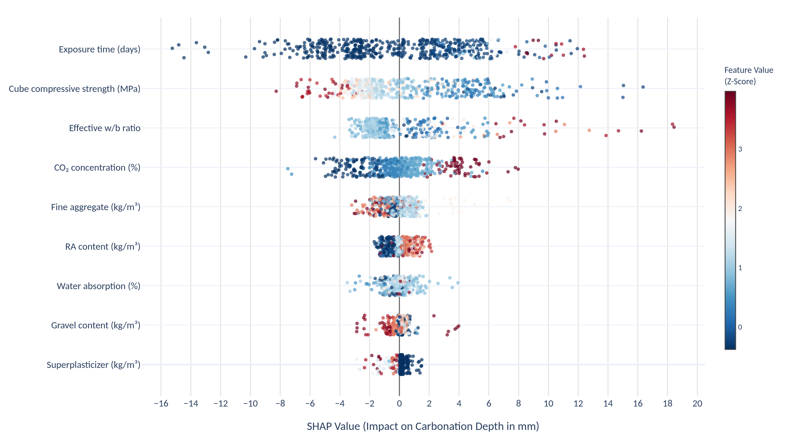
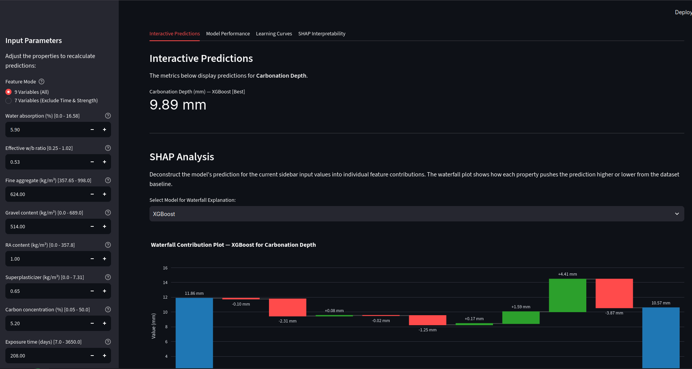

# Toolkit for Carbonation Depth Prediction in Recycled Aggregate Concrete

**Machine Learning Comparisons and Explainable AI**

> A research toolkit that benchmarks 8 machine learning models for predicting carbonation depth in recycled aggregate concrete, with SHAP-based explainability and an interactive Streamlit dashboard.

**Author:** Eduardo Prasniewski  
**Institutions:** [Université Laval](https://www.ulaval.ca/) (IMOM Lab) · [UTFPR](https://www.utfpr.edu.br/) · [Mitacs](https://www.mitacs.ca/)

---

<details open>
<summary><b>Table of Contents / Sumário</b> (Click to expand/collapse)</summary>

- [Motivation](#motivation)
- [Dataset](#dataset)
  - [Input Features (9 Variables)](#input-features-9-variables)
  - [Target Variable](#target-variable)
- [Machine Learning Models](#machine-learning-models)
  - [Performance Comparison (9-Variable Model)](#performance-comparison-9-variable-model)
- [SHAP Interpretability](#shap-interpretability)
  - [Global Feature Importance (XGBoost)](#global-feature-importance-xgboost)
- [Interactive Web Application](#interactive-web-application)
  - [Features](#features)
- [Project Architecture](#project-architecture)
- [Installation & Usage](#installation--usage)
  - [Prerequisites](#prerequisites)
  - [Setup](#setup)
  - [Training](#training)
  - [Running the Web Application](#running-the-web-application)
  - [Generating Publication Figures](#generating-publication-figures)
- [Tech Stack](#tech-stack)
- [References](#references)
- [Acknowledgments](#acknowledgments)

</details>

---

## Motivation

The construction industry generates up to 35% of municipal solid waste, while mining operations produce over 10 billion tons of tailings annually. Crushing construction and demolition waste (CDW) into **Recycled Concrete Aggregates (RCA)** enables a circular economy approach, but introduces a critical durability concern: **concrete carbonation**.

Atmospheric CO₂ reacts with calcium hydroxide in cement paste (CO₂ + Ca(OH)₂ → CaCO₃ + H₂O), progressively lowering the pH from ~12.5 to below 9.0. Once the carbonation front reaches the reinforcement steel, depassivation occurs and corrosion begins. Recycled aggregates amplify this problem — their higher porosity from adhered old mortar accelerates CO₂ ingress.

Traditional carbonation testing requires 28–56+ days of accelerated exposure. This toolkit applies **machine learning** to predict carbonation depth from concrete mix proportions and exposure conditions, enabling rapid durability screening without lengthy laboratory testing.

---

## Dataset

The dataset consists of **529 curated records** (filtered from 728 raw records) collected from published experimental studies on recycled aggregate concrete carbonation.

### Input Features (9 Variables)

| Variable | Category | Physical Role | Range |
|---|---|---|---|
| Water Absorption (%) | Aggregate Property | Porosity indicator | 0.0 – 16.58 |
| Effective W/B Ratio | Mix Proportion | Primary matrix density controller | 0.25 – 1.02 |
| Fine Aggregate (kg/m³) | Mix Proportion | Fills interstitial spaces | 357.65 – 998.0 |
| Gravel Content (kg/m³) | Mix Proportion | Rigid skeleton | 0.0 – 689.0 |
| Recycled Aggregate (kg/m³) | Mix Proportion | Old mortar increases porosity | 0.0 – 357.8 |
| Superplasticizer (kg/m³) | Chemical Admixture | Enables low W/B workability | 0.0 – 7.31 |
| CO₂ Concentration (%) | Environmental State | Thermodynamic driving force | 0.05 – 50.0 |
| Exposure Time (days) | Environmental State | Depth ∝ √t | 7.0 – 3650.0 |
| Compressive Strength (MPa) | Domain-Guided Input | Macro-indicator of matrix density | 15.0 – 90.0 |

### Target Variable

- **Carbonation Depth (mm)** — Mean: 11.47 mm, Std: 9.11 mm, Range: 0.21 – 50.06 mm

> **Design Decision:** Compressive strength was initially treated as a second prediction target. After domain analysis, it was moved to an input feature because the correlation between compressive strength and recycled aggregate content is inverse and non-linear, which created conflicting optimization gradients in a dual-target setup.

---

## Machine Learning Models

Eight models are benchmarked using **5-Fold Cross-Validation** with **Optuna Bayesian hyperparameter optimization** (500 trials per model). StandardScaler is applied strictly inside each fold to prevent data leakage.

### Performance Comparison (9-Variable Model)

| Rank | Model | MSE | RMSE (mm) | MAE (mm) | R² Score |
|:---:|---|:---:|:---:|:---:|:---:|
| 1 | **XGBoost** | **0.3900** | **0.6245** | **0.4330** | **0.9953** |
| 2 | **CatBoost** | **0.4063** | **0.6374** | **0.4480** | **0.9951** |
| 3 | LightGBM | 1.0051 | 1.0026 | 0.6210 | 0.9879 |
| 4 | Random Forest | 1.5534 | 1.2464 | 0.8322 | 0.9812 |
| 5 | SVR | 2.8752 | 1.6956 | 1.0081 | 0.9653 |
| 6 | MLP | 6.1046 | 2.4708 | 1.7891 | 0.9263 |
| 7 | Ridge Regression | 50.2644 | 7.0897 | 4.9055 | 0.3930 |
| 8 | TabNet | 193.3912 | 13.9065 | 10.7782 | -1.3355 |

**Key Finding:** Tree-based gradient boosting ensembles (XGBoost, CatBoost) achieve R² > 0.99, dramatically outperforming deep learning (MLP, TabNet) and classical linear approaches on this tabular dataset.

---

## SHAP Interpretability

SHAP (SHapley Additive exPlanations) values are computed out-of-fold during training for all tree-based models, and rescaled from standardized space back to physical units (mm).

### Global Feature Importance (XGBoost)



**Key Insights:**
- **Exposure Time** is the most critical predictor — longer exposure allows deeper CO₂ penetration (depth ∝ √time).
- **Compressive Strength** is a strong negative driver — a denser matrix retards CO₂ diffusion.
- **W/B Ratio** and **Recycled Aggregate Content** positively correlate with deeper carbonation due to increased porosity.

---

## Interactive Web Application

A Streamlit-based dashboard provides real-time inference, model comparison, and SHAP analysis.



### Features

- **Feature Mode Toggle:** Switch between 9 variables (all features) and 7 variables (excluding Exposure Time and Compressive Strength) to analyze the impact of well-known parameters.
- **Interactive Predictions:** Adjust mix proportions via sliders and get instant predictions from all 8 models, with a per-prediction SHAP waterfall chart.
- **Model Performance:** 5-Fold CV metrics summary table and R² comparison bar chart.
- **Learning Curves:** Training vs. validation loss curves for iterative models.
- **SHAP Interpretability:** Interactive Plotly beeswarm and feature importance bar charts for tree-based models.

---

## Project Architecture

```
├── app.py                          # Streamlit web application entry point
├── main.py                         # Training pipeline (9-variable models)
├── train_7var.py                   # Training pipeline (7-variable models)
├── generate_latex_figures.py       # Export publication-quality PDF figures
│
├── model/                          # ML models layer
│   ├── base_model.py               # Abstract base class (train, predict, reset, save)
│   ├── base_predictor.py           # Abstract base class for inference
│   ├── loader.py                   # Dataset loading with dynamic feature dropping
│   ├── training.py                 # TrainingOrchestrator: 5-Fold CV, Optuna, SHAP
│   ├── predictor_implementations.py # Ensemble K-fold inference predictors
│   ├── xgb.py / lgbm.py / cat.py  # Gradient boosting models
│   ├── rf.py / svr.py / ridge.py  # Classical ML models
│   ├── mlp.py                      # PyTorch neural network (3-layer MLP)
│   └── tabnet.py                   # Attention-based deep learning
│
├── presentation/                   # Streamlit UI layer
│   ├── inputs.py                   # Session state, input fields, validation
│   ├── styles.py                   # Page configuration and custom CSS
│   └── tabs/                       # Tab view components
│       ├── predictions_tab.py      # Interactive predictions + SHAP waterfall
│       ├── performance_tab.py      # 5-Fold CV metrics table + charts
│       ├── learning_tab.py         # Training/validation loss curves
│       └── shap_tab.py             # Global SHAP analysis
│
├── interpretability/               # SHAP analysis layer
│   ├── shap_engine.py              # Local & global SHAP computation
│   └── visualizer.py               # Plotly-based SHAP renderers
│
├── checkpoints_9var/               # Trained 9-variable model checkpoints
├── checkpoints_7var/               # Trained 7-variable model checkpoints
└── figures/                        # Generated publication-quality figures
```

---

## Installation & Usage

### Prerequisites

- Python ≥ 3.13
- [uv](https://docs.astral.sh/uv/) package manager

### Setup

```bash
# Clone the repository
git clone <repository-url>
cd Database

# Install dependencies
uv sync
```

### Training

```bash
# Train all 8 models with 9 input variables
uv run python main.py

# Train all 8 models with 7 input variables (excluding Exposure Time & Compressive Strength)
uv run python train_7var.py
```

### Running the Web Application

```bash
uv run streamlit run app.py
```

### Generating Publication Figures

```bash
# Export SHAP and learning curve plots as PDFs for LaTeX
uv run python generate_latex_figures.py
```

---

## Tech Stack

| Category | Libraries |
|---|---|
| ML Frameworks | scikit-learn, XGBoost, LightGBM, CatBoost, pytorch-tabnet |
| Deep Learning | PyTorch |
| Hyperparameter Tuning | Optuna (500 trials per model) |
| Interpretability | SHAP |
| Web Application | Streamlit, Plotly |
| Data Processing | pandas, NumPy |
| Experiment Tracking | MLflow |

---

## References

1. Zheng et al. (2022). Carbonation resistance and pore structure of recycled aggregate concrete. *Materials*.
2. Moghaddas et al. (2022). Modeling carbonation depth of recycled aggregate concrete. *Journal of Cleaner Production*.
3. Londhe et al. (2022). Tree-based approaches for carbonation coefficient. *Applied Sciences*.
4. Alizamir et al. (2026). XGBoost with SHAP for RAC carbonation. *Artificial Intelligence Review*.
5. Chen et al. (2026). Optuna-optimized explainable ML for RAC carbonation. *Buildings*.
6. Alyami et al. (2024). Hybrid ML for copper mine tailings concrete. *Case Studies in Construction Materials*.
7. Dassanayake et al. (2026). Mining waste as construction resource. *Sustainability*.
8. Li et al. (2022). ML in concrete science best practices. *npj Computational Materials*.

---

## Acknowledgments

This research was conducted as part of a Mitacs Globalink Research Internship at the **IMOM Laboratory**, **Université Laval** (Québec, Canada), in collaboration with **UTFPR** (Universidade Tecnológica Federal do Paraná, Brazil).
